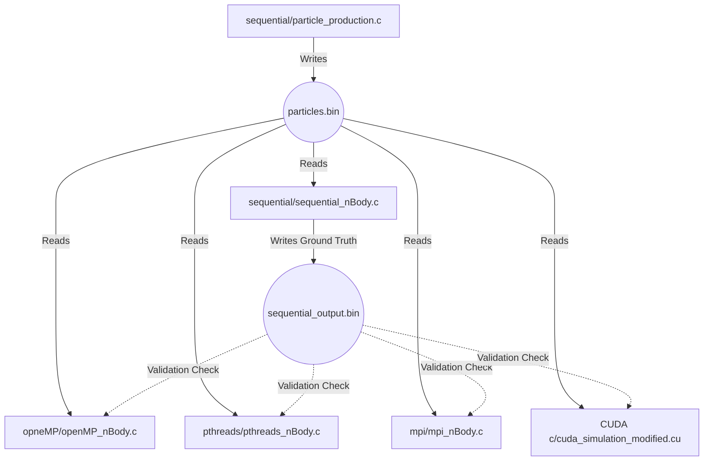

# Complete N-Body Project Workflow & File Architecture

This document serves as the master blueprint for the N-Body simulation project. It explains the purpose of every file, how data flows through the system, and exactly which functions are executed at each step of the pipeline.

---

## 🗺️ The Macroscopic Data Flow (The Big Picture)

The entire project operates on a **Single Source of Truth** pipeline. This ensures that every parallel paradigm is tested on the exact same physics environment, allowing for rigorous accuracy validation.

---

## 📂 Deep Dive: File-by-File Breakdown

### Phase 1: Data Initialization
#### `sequential/particle_production.c`
- **What it does**: This is the very first program you must run. It creates the universe.
- **Workflow**: 
  1. `main()` accepts the number of particles as a command-line argument.
  2. It calls `randomizeParticles()`, utilizing a fixed random seed (`srand(0)`) to generate identical starting masses, positions ($x, y, z$), and velocities ($v_x, v_y, v_z$) across runs.
  3. It writes the universe array to `particles.bin` in the root directory.

### Phase 2: Generating the Ground Truth Baseline
#### `sequential/sequential_nBody.c`
- **What it does**: Runs the physics engine sequentially (on 1 CPU core) to establish the baseline execution time ($1.00\times$) and the mathematical Ground Truth.
- **Workflow**:
  1. Opens and reads `particles.bin`.
  2. Iterates through the time steps using a `for` loop.
  3. Inside the loop, it calls `bodyForce(particles, dt, nBodies)`. This function is $O(N^2)$, utilizing a double-nested loop to calculate the gravitational pull every particle exerts on every other particle.
  4. Updates the positions of the particles based on the computed forces.
  5. Saves the final universe state to `sequential_output.bin`.

### Phase 3: Parallel Execution & Validation
Every file below follows a similar workflow: read `particles.bin`, accelerate the physics math, and finally load `sequential_output.bin` to calculate the floating-point deviation (Accuracy Validation).

#### 1. `opneMP/openMP_nBody.c` (Shared Memory)
- **What it does**: Automatically distributes the outer loops among available CPU cores using compiler magic.
- **Key Functions / Mechanisms**:
  - `omp_set_num_threads()`: Sets how many CPU cores to use.
  - `#pragma omp parallel for`: This directive tells the OpenMP library to split the $N$ particles evenly among the threads. If thread 1 is processing particle $i$, thread 2 processes particle $i+1$ simultaneously.
  - Variable Privacy: Variables like `Fx, Fy, Fz` are declared *inside* the loop so they are private to each thread, preventing race conditions.

#### 2. `pthreads/pthreads_nBody.c` (Shared Memory)
- **What it does**: Performs the same task as OpenMP, but manually manages the OS-level threads.
- **Key Functions / Mechanisms**:
  - `main()` mathematically chunks the array (`nBodies / num_threads`) and creates `ThreadData` structs.
  - `pthread_create()`: Asks the OS to spawn a raw thread.
  - `threadFunc()`: The custom function each thread executes. It extracts its specific workload boundaries (start and end indexes) from the struct and calls `bodyForce()`.
  - `pthread_join()`: Blocks the main program until all threads finish computing the iteration.

#### 3. `mpi/mpi_nBody.c` (Distributed Memory)
- **What it does**: Designed for HPC clusters where CPUs do not share the same RAM. Data must be physically sent over the network.
- **Key Functions / Mechanisms**:
  - `MPI_Init()` / `MPI_Comm_rank()`: Bootstraps the distributed environment and gives each process an ID (`myrank`).
  - `MPI_Bcast()`: The Master node (Rank 0) broadcasts the entire `particles.bin` universe state over the network to every worker node.
  - **Computation**: Each worker mathematically computes its assigned chunk of particles using `bodyForce()`.
  - `MPI_Gatherv()`: Pushes all the updated particle chunks back over the network to the Master node to assemble the next iteration's state.

#### 4. `CUDA c/cuda_simulation_modified.cu` (GPU Acceleration)
- **What it does**: Offloads the computationally heavy physics engine from the CPU to an NVIDIA GPU.
- **Key Functions / Mechanisms**:
  - `readFile()`: Reads `particles.bin` into host (CPU) RAM.
  - `cudaMalloc()` / `cudaMemcpy(..., cudaMemcpyHostToDevice)`: Allocates VRAM on the GPU and copies the universe data into it.
  - `bodyForce<<<gridDim, blockDim>>>()`: This is the **Kernel Function**. Instead of a loop, the GPU spawns thousands of lightweight threads simultaneously (e.g., 10,000 threads). Each thread is given a unique ID (`blockIdx.x * blockDim.x + threadIdx.x`) which corresponds directly to a single particle $i$. The thread calculates the gravity for *only* its assigned particle.
  - `cudaMemcpy(..., cudaMemcpyDeviceToHost)`: Copies the computed results back to the CPU.
  - **Validation**: At the end of `main()`, the CPU calculates the floating-point difference between the GPU's FMA architecture output and the sequential baseline.
